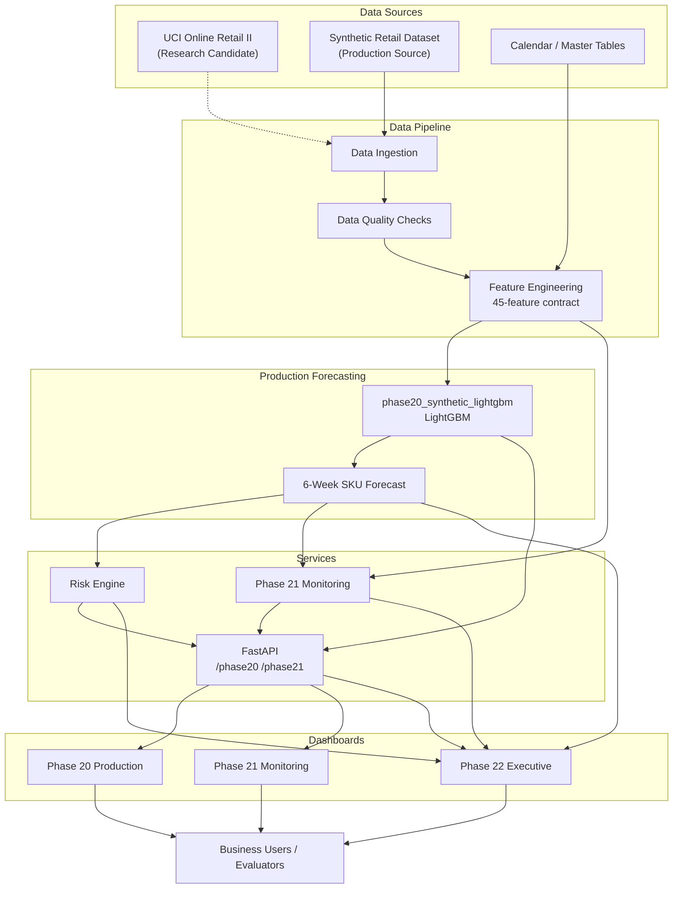

# Phase 22 — System Architecture

## Overview

PROJECT FORESIGHT is a retail demand forecasting and inventory risk decision-support system. The promoted production model (`phase20_synthetic_lightgbm`) forecasts weekly SKU-level demand for 6 weeks using the SYNTHETIC dataset.

## Conceptual Flow

```
DATA SOURCES
      │
      ▼
DATA INGESTION
      │
      ▼
DATA QUALITY
      │
      ▼
FEATURE ENGINEERING
      │
      ▼
FORECASTING
      │
      ▼
6-WEEK PRODUCTION FORECAST
      │
      ├───────────────┐
      ▼               ▼
RISK ENGINE      MONITORING
      │               │
      ▼               ▼
RECOMMENDATIONS   ALERTS / HEALTH
      │               │
      └───────┬───────┘
              ▼
       API / DASHBOARD
              │
              ▼
       BUSINESS DECISION
```

## Architecture Diagram



## Phase Roles

| Phase | Role |
|-------|------|
| **Phase 17** | Controlled dataset integration; UCI + Synthetic pipelines; baseline comparison; candidate forecasting |
| **Phase 18** | Promotion gate; independent validation; SYNTHETIC promoted with limitations |
| **Phase 19** | Candidate hardening; holiday features; horizon analysis; WAPE improved to 13.96% |
| **Phase 20** | Controlled production promotion; API, risk adapter, production dashboard |
| **Phase 21** | Observability layer; data/feature quality, drift, integrity monitoring |
| **Phase 22** | Final delivery; executive dashboard, documentation, Zidio submission package |

## Key Components

- **Production model:** `models/final/phase20/phase20_synthetic_lightgbm.joblib`
- **Feature contract:** `docs/phase20_feature_contract.json` (45 features)
- **API:** `src/api/app.py` with `/phase20` and `/phase21` routes
- **Risk engine:** `src/phase20_risk_adapter.py`
- **Monitoring:** `src/phase21_monitoring.py`

## Deployment Status

Local FastAPI + Streamlit dashboards are implemented. **Cloud deployment is LIVE:** Vercel frontend + Render FastAPI (see README Live Application section).
